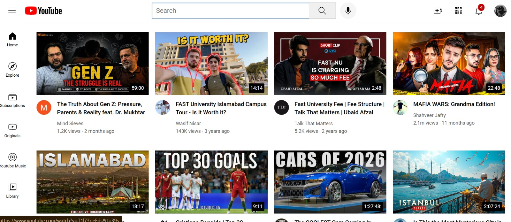

#**Youtube Clone**

*A responsive Youtube homepage clone built using HTML and CSS as part of my web development learning journey.*

#**Live Demo**
🌐 https://youtube-clone-beta-rust.vercel.app/

✨**Github Repository**
https://github.com/Sarah-Ather1/Youtube-Clone

📸**ScreenShot**

#**Features**:
- Responsive Youtube-style Layout
- Fixed Navigation Header
- Sidebar Navigation
- Video Grid with thumbnails
- Channel Information
- Hover effects
- Clean UI

💻**Technologies Used**
- HTML
- CSS

🛠️**Tools & Platforms**
- Git
- Github
- Vercel
- Visual Studio Code

📚**What I Learned**
*Through this project, I learned:*

- HTML page structure
- CSS Flexbox
- CSS Grid
- CSS Positioning (Fixed & Absolute)
- Responsive Web Design
- Deploying Projects using Vercel

#**Future Improvements:**
- Add Javascript functionality
- Implement search
- Mode chaning
- Improving responsiveness

**Developed by Sarah-Ather**
